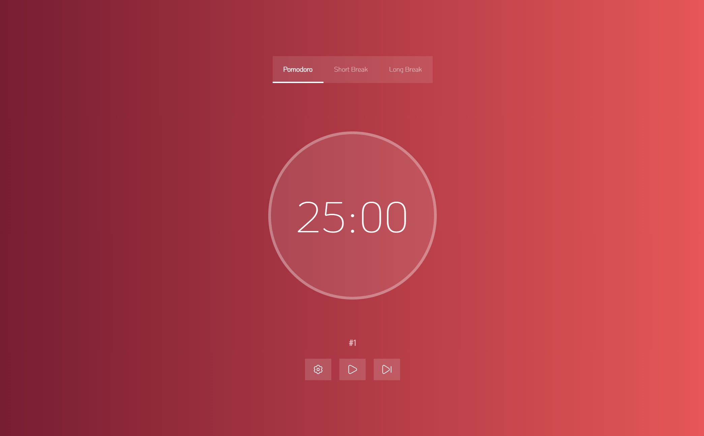

# PomoApp

> Pomodoro Timer App



PomoApp is a customizable pomodoro timer. The main objective of this application is to help you maintain focus on any task you need, from working to studying.

## Features

- Responsive design for mobile and desktop devices
- Alarm notification at the end of each pomodoro
- The duration of each mode is editable
- Friendly UI
   
## Built with

- Next.js
- Redux
- Tailwind CSS

## Live Demo

[Live Demo Link](https://pomoapp-sv.vercel.app/)

## Getting Started

To create a copy and run it locally

### Requisites

- NodeJS
- Yarn

### Setup

```bash
git clone https://github.com/sebastianvarelag/pomo-app
cd ./pomo-app
```

### Install

```bash
yarn
```

### Usage

```bash
yarn start
```

### Build

```bash
yarn build
```

### Run tests

```bash
yarn test
```

## Author

👨🏻‍💻 **Sebastián Varela Giraldo**

- Linkedin: [Linkedin](https://www.linkedin.com/in/sebastianvarelag/)
- GitHub: [@sebastianvarelag](https://github.com/sebastianvarelag)
